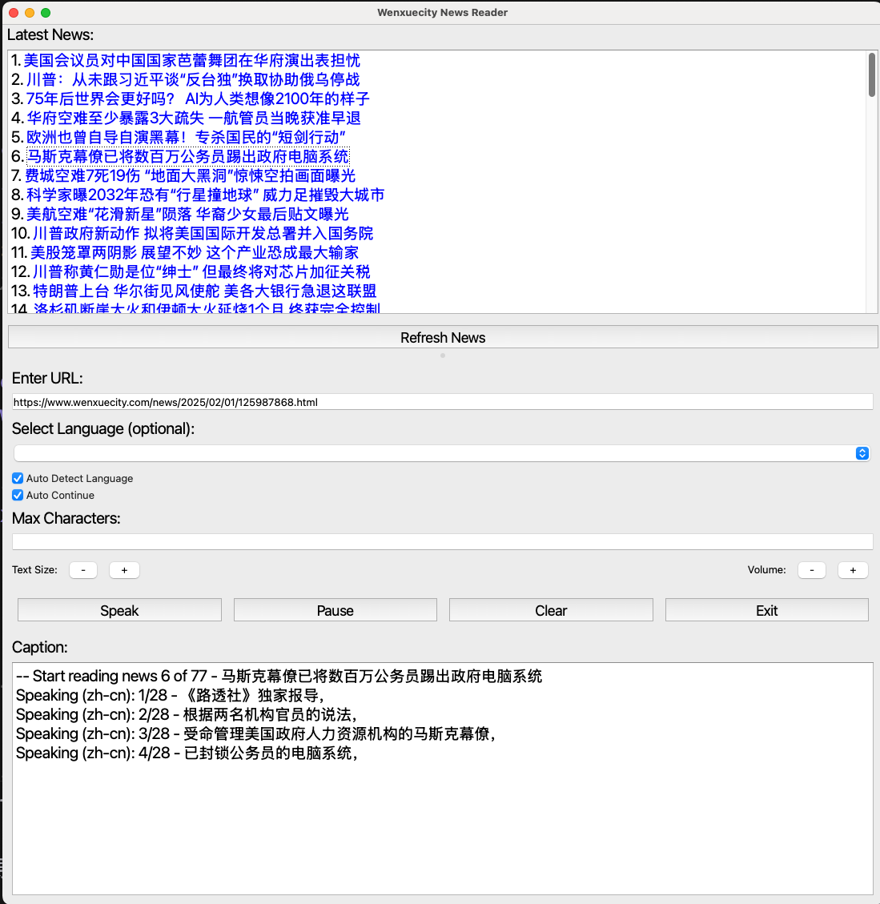

# Wenxuecity Text-to-Speech News Reader


A PyQt5-based application that converts news articles from Wenxuecity into spoken audio with automatic language detection and seamless article continuation.

 <!-- Add actual screenshot later -->

## Features

- **Smart Article Navigation**
  - Auto-continue to next article with title announcement
  - Manual article selection from history
  - Index tracking (X/Y articles)
  
- **Multi-language Support**
  - Automatic English/Chinese detection
  - Fallback language selection
  - Per-article language override

- **Audio Controls**
  - Real-time volume adjustment
  - Play/pause/resume functionality
  - Background audio processing
  - 500ms inter-article pause

- **Content Processing**
  - Web scraping with automatic text cleaning
  - Configurable character limits (default: 500 chars)
  - Progress saving/resuming

- **Visual Feedback**
  - Current word highlighting
  - System tray notifications
  - Error handling display

## Requirements

- Core Dependencies:
  ```bash
  # Install via pip
  PyQt5>=5.15.7, gTTS>=2.3.2, fasttext>=0.9.2, 
  langdetect>=1.0.9, mutagen>=1.45.1
  ```

- Web Scraping:
  ```bash
  requests>=2.26.0, beautifulsoup4>=4.10.0, lxml>=4.6.3
  ```

- FastText Model:
  ```bash
  wget https://dl.fbaipublicfiles.com/fasttext/supervised-models/lid.176.bin
  mkdir -p models && mv lid.176.bin models/
  ```
- First-time Setup
Download the FastText language model:
  ```
  bash
  wget https://dl.fbaipublicfiles.com/fasttext/supervised-models/lid.176.bin
  mkdir -p models && mv lid.176.bin models/
  ``` 

## Installation

```bash
# Clone repository
git clone https://github.com/yourusername/Wenxuecity-tts.git
cd Wenxuecity-tts

# Install requirements
python -m pip install -r requirements.txt

# Optional: Install as CLI application
python -m pip install -e .
```

## Usage

### GUI Application
```bash
Wenxuecity-tts  # From installed package
# OR
python -m Wenxuecity_tts.wxc_gui  # From source
```

### Command Line Options
```bash
# Batch process URLs from file
Wenxuecity-tts --input urls.txt --output-dir ./articles

# CLI arguments
  --lang [en|zh-cn]    Force output language
  --volume [0-100]     Set initial volume
  --chars-limit N      Set character limit per article
```

## Configuration

Create `.env` file in project root:
```ini
# Default settings
AUTO_CONTINUE=1
DEFAULT_VOLUME=75
MAX_HISTORY=50
CACHE_DIR=./.news_cache
```

## Development

### Building macOS Application

1. Install build tools:
```bash
pip install pyinstaller
```

2. Create application bundle:
```bash
# From project root
pyinstaller wxc-tts.spec --noconfirm
```

3. Create DMG installer:
```bash
# Create compressed disk image
hdiutil create -volname "Wenxuecity TTS" \
  -srcfolder "dist/WenxuecityTTS.app" \
  -ov -format UDZO \
  "dist/WenxuecityTTS_$(date +%Y%m%d).dmg"
```

### Advanced Build Options

For production releases:
```bash
# Universal build (Intel + Apple Silicon)
pyinstaller --target-arch universal2 --name WenxuecityTTS-universal ...

# Code signing (requires developer ID)
codesign --deep --force --verify --verbose \
  --sign "Developer ID Application: Your Name (XXXXXXXXXX)" \
  dist/WenxuecityTTS.app

# Notarization (macOS 10.15+ required)
xcrun notarytool submit "dist/WenxuecityTTS.dmg" \
  --keychain-profile "AC_PASSWORD" \
  --wait
```

### Build Artifacts
- Application bundle: `dist/WenxuecityTTS.app`
- Installer package: `dist/WenxuecityTTS_YYYYMMDD.dmg`
- Build logs: `build/` directory

## License

Distributed under MIT License. See `LICENSE`

## Distribution

### Publishing Releases

1. Install GitHub CLI:
```bash
brew install gh
gh auth login
```

2. Create a new release:
```bash
gh release create v1.0.0 \
  --title "Version 1.0.0" \
  --notes "Initial release" \
  dist/WenxuecityTTS.dmg
```

3. Update existing release:
```bash
gh release upload v1.0.0 dist/WenxuecityTTS_UPDATE.dmg
```

### Download Links
Always available at:  
https://github.com/coder6688/wenxuecity-tts/releases/latest